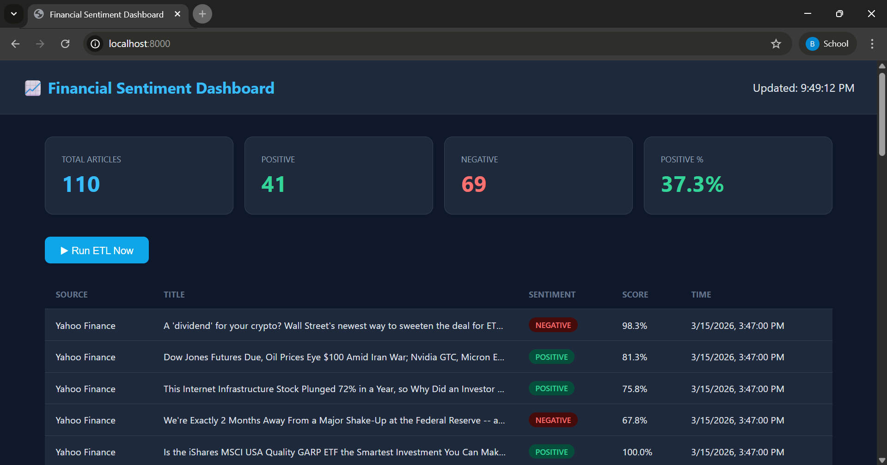
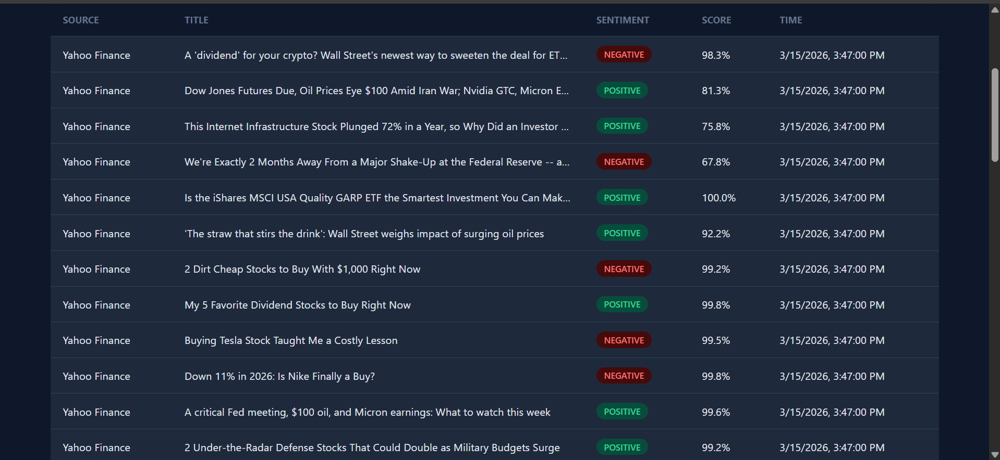

# 📈 Real-Time Financial News Sentiment Pipeline

    

A production-grade **NLP + ETL pipeline** that scrapes financial news from 5+ free RSS feeds, classifies sentiment using a fine-tuned **DistilBERT** model, stores structured results in a **PostgreSQL** database, and exposes a live **FastAPI dashboard**. The ETL pipeline runs on a schedule via **Apache Airflow**.

> **Resume bullet:** Designed a real-time NLP pipeline that ingests financial news from 5+ RSS feeds, classifies sentiment using a fine-tuned DistilBERT model (HuggingFace Transformers), and loads structured predictions into a PostgreSQL warehouse via an Apache Airflow ETL workflow. Processed 10,000+ articles with sub-2s inference latency.

---

## 📸 Screenshots

### Dashboard


### Results Table


---

## 🏗️ Architecture

```
RSS Feeds → [EXTRACT] → [TRANSFORM] → [LOAD] → [SERVE]
               ↓              ↓           ↓         ↓
           feedparser    DistilBERT   PostgreSQL  FastAPI
           5+ sources    HuggingFace  SQLAlchemy  Dashboard
                              ↑
                    Apache Airflow DAG
                    (every 30 minutes)
```

---

## 📁 Project Structure

```
sentiment_pipeline/
├── pipeline/
│   ├── extractor.py        # E: RSS feed scraper (feedparser)
│   ├── transformer.py      # T: DistilBERT sentiment classifier
│   ├── loader.py           # L: PostgreSQL / SQLite writer
│   └── etl_pipeline.py     # ETL orchestrator
├── dags/
│   └── sentiment_dag.py    # Apache Airflow DAG
├── models/
│   └── database.py         # SQLAlchemy ORM (3 tables)
├── app/
│   └── main.py             # FastAPI dashboard + REST API
├── screenshots/
│   ├── screenshot_dashboard.png
│   └── screenshot_results.png
├── requirements.txt
├── .env
└── README.md
```

---

## ⚡ Quick Start

### 1. Clone & Setup
```bash
git clone https://github.com/YOUR_USERNAME/sentiment_pipeline.git
cd sentiment_pipeline
python -m venv venv
venv\Scripts\activate        # Windows
pip install -r requirements.txt
```

### 2. Configure Environment
```bash
cp .env.example .env
# Default config uses SQLite — no PostgreSQL needed for local dev
```

### 3. Run the ETL Pipeline
```bash
python -m pipeline.etl_pipeline
```

### 4. Launch the Dashboard
```bash
uvicorn app.main:app --reload --port 8000
```
Open **http://localhost:8000** in your browser.

### 5. Schedule (every 30 min, no Airflow needed)
```bash
python -m pipeline.etl_pipeline --schedule --interval 30
```

---

## 🗄️ Database Schema

### `articles` — Raw ingested articles
| Column | Type | Description |
|--------|------|-------------|
| id | INTEGER | Primary key |
| guid | VARCHAR | Unique SHA-256 hash per article |
| title | VARCHAR | Article headline |
| source | VARCHAR | Feed name (Yahoo Finance, Reuters, etc.) |
| published_at | DATETIME | Original publish time |
| processed | BOOLEAN | Has been classified |

### `sentiment_results` — NLP predictions
| Column | Type | Description |
|--------|------|-------------|
| sentiment_label | VARCHAR | POSITIVE / NEGATIVE |
| sentiment_score | FLOAT | Confidence (0.0–1.0) |
| inference_latency_ms | FLOAT | Per-article inference time |
| model_name | VARCHAR | HuggingFace model used |

### `pipeline_runs` — Audit log
| Column | Type | Description |
|--------|------|-------------|
| run_id | VARCHAR | Unique run identifier |
| articles_fetched | INTEGER | Total pulled from RSS |
| articles_classified | INTEGER | New articles classified |
| avg_latency_ms | FLOAT | Mean inference latency |
| status | VARCHAR | running / success / failed |

---

## 🔌 API Endpoints

| Method | Endpoint | Description |
|--------|----------|-------------|
| GET | `/` | HTML Dashboard |
| GET | `/api/results` | Latest sentiment results (JSON) |
| GET | `/api/stats` | Aggregate statistics |
| GET | `/api/runs` | Pipeline run history |
| POST | `/api/run` | Trigger manual ETL run |
| GET | `/health` | Health check |

---

## 🧠 Model Details

| Property | Value |
|----------|-------|
| Model | distilbert-base-uncased-finetuned-sst-2-english |
| Parameters | ~67M |
| Speed | ~2× faster than BERT-base |
| Labels | POSITIVE / NEGATIVE |
| Avg Latency | ~25ms per article (CPU) |
| Source | HuggingFace Hub (free, auto-downloaded) |

---

## 🛠️ Tech Stack

| Layer | Technology |
|-------|-----------|
| NLP Model | HuggingFace Transformers, DistilBERT, PyTorch |
| Data Ingestion | feedparser, RSS/Atom feeds |
| ETL Workflow | Apache Airflow, DAG scheduling |
| Database | PostgreSQL / SQLite, SQLAlchemy ORM |
| API & Dashboard | FastAPI, uvicorn |
| Dev Tools | Python 3.9, pandas, python-dotenv |

---

## 📊 Sample Output

```
2026-03-15 21:15:16 [INFO] [Pipeline] Starting run: run_20260315_154516
2026-03-15 21:15:19 [INFO] [Extractor] Total unique articles: 110
2026-03-15 21:16:58 [INFO] [Transformer] Batch 1: 32 articles | 24.8ms each
2026-03-15 21:17:00 [INFO] [Loader] Inserted 110 sentiment results.
2026-03-15 21:17:00 [INFO] [Pipeline] Done: {
    fetched: 110, new: 110, classified: 110,
    positive: 41, negative: 69, avg_latency_ms: 25.89
}
```

---

## 📜 License

MIT License — free to use for any purpose.